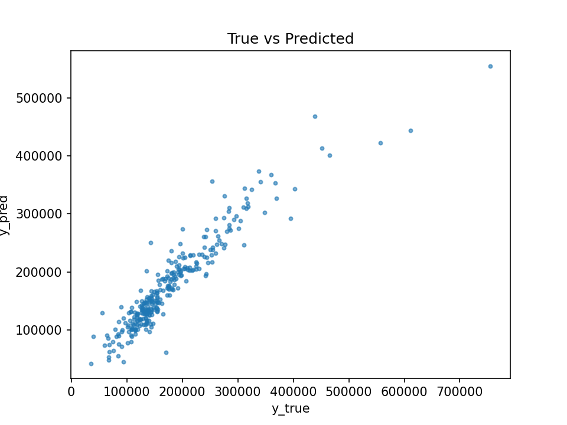
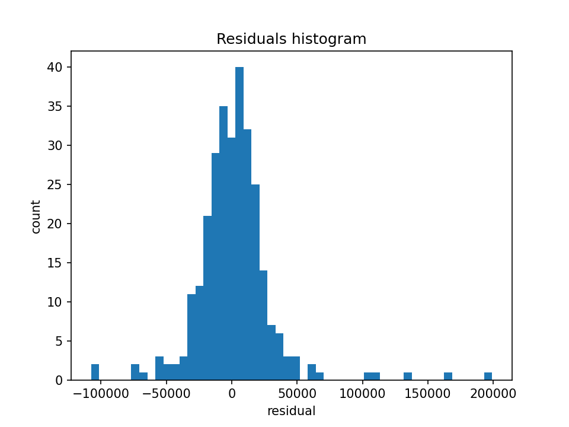

# Real Estate Pricing API

Модель регрессии для оценки стоимости недвижимости. 
Сервис имеет API (FastAPI) и CLI для пакетной оценки. В репозитории есть отчёты с графиками качества.




---

## Цель проекта
Помочь отделу продаж быстро оценивать рыночную стоимость объектов по признакам (площадь, качество отделки, гараж, год постройки и др.), чтобы ускорить выдачу офферов и фильтрацию объектов.

---

## Решение
- Признаки: числовые и категориальные; предобработка через ColumnTransformer (импьютация пропусков, масштабирование, OHE).
- Модель: Ridge / ElasticNet (линейные, интерпретируемые, устойчивые).
- Валидация: train/test сплит с фиксированным seed для воспроизводимости.
- Интерфейсы:
  - API — эндпоинты /predict_one и /predict_csv.
  - CLI — пакетная инференция CSV.
- Конфиг: config.yaml (таргет, путь к модели).

---

## Метрики (снимок)
| Метрика | Значение |
|--------|----------|
| MAE    | 19008.38 |
| RMSE   | 29844.98 |
| R²     | 0.884    |

Графики: report/y_true_vs_pred.png (истинные vs предсказанные), report/residuals_hist.png (распределение остатков). 
См. также report/metrics.md.

---

## Быстрый старт

Окружение и запуск API:
```
python -m venv .venv
.\.venv\Scripts ctivate
pip install -r requirements.txt
python -m uvicorn src.app:app --host 127.0.0.1 --port 8000 --reload
```

Swagger UI: http://127.0.0.1:8000/docs
Healthcheck: http://127.0.0.1:8000/health

Docker:
```
docker build -t real-estate-pricing .
docker run -p 8000:8000 real-estate-pricing
```

---

## Использование

Обучение:
```
python src/train.py --input data/train.csv --output model/model.pkl
```

Пакетный скоринг (CLI):
```
python src/predict.py --config config.yaml --input data/new_objects.csv --output predictions.csv
```

Пример API-запроса:
```
curl -X POST "http://127.0.0.1:8000/predict_one" -H "Content-Type: application/json" -d "{\"features\":{\"GrLivArea\":1800,\"OverallQual\":7,\"GarageCars\":2,\"YearBuilt\":2005}}"
```

---

## Конфиг (config.yaml)
```
title: "Real Estate Pricing"
model_path: "model/model.pkl"
target_col: "SalePrice"
drop_cols: []
```

---

## Отчёты
Генерация графиков и метрик:
```
python report/plots.py
```
Результаты: report/metrics.md, report/y_true_vs_pred.png, report/residuals_hist.png.

---

## Структура
```
real_estate_pricing/
 ├── src/
 │   ├── train.py
 │   ├── predict.py
 │   └── app.py
 ├── report/
 ├── schemas/
 ├── config.yaml
 ├── DATA_PRIVACY.md
 ├── MODEL_CARD.md
 ├── requirements.txt
 └── README.md
```

---

## Приватность данных
Данные клиента не публикуются (NDA). Репозиторий содержит код, конфиги и артефакты качества. Для интеграции используйте свои данные согласно config.yaml и API-контракту.
